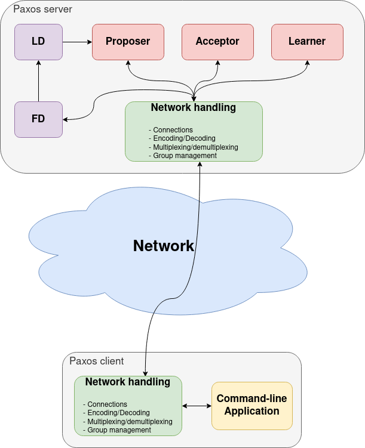
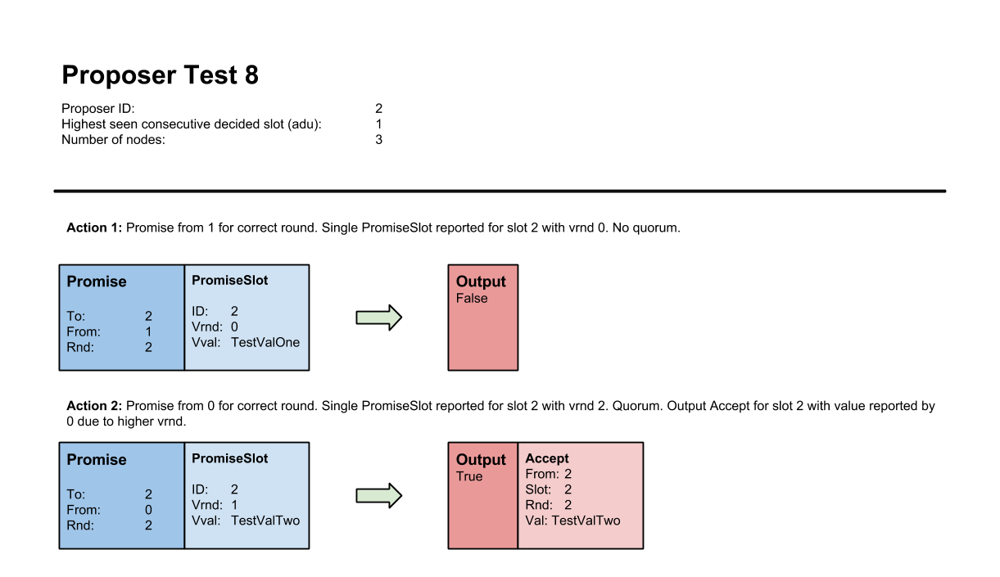

# Distributed bank system

## Table of Contents

- [Distributed bank system](#distributed-bank-system)
  - [Table of Contents](#table-of-contents)
  - [Multi-Paxos](#multi-paxos)
    - [Background and Resources](#background-and-resources)
    - [Algorithm implementation](#algorithm-implementation)
      - [Specification](#specification)
      - [Multi-Paxos Package](#multi-paxos-package)
      - [Distributed Multi-Paxos Application](#distributed-multi-paxos-application)
      - [Paxos Server](#paxos-server)
    - [Appendix - Proposer Test Cases](#appendix---proposer-test-cases)
  - [Bank with Reconfiguration](#bank-with-reconfiguration)
    - [Introduction](#introduction)
    - [Reconfiguration scheme](#reconfiguration-scheme)
  - [Bank Javascript Client](#bank-javascript-client)
  - [References](#references)

## Multi-Paxos

### Background and Resources

Practical systems normally use Paxos as a building block to achieve consensus
on a sequence of values.
One way to achieve this would be to run a full instance of single-decree Paxos, both _Phase 1 and 2_, for every value.
This would require four message delays for every value to be decided.
With Multi-Paxos it is possible to reduce this overhead.

Multi-Paxos only perform _Phase 1_ once, when the leader change.
A Proposer, thinking it is the new leader, issues a prepare for every slot higher than the highest consecutive decided slot it has seen.
Every other Paxos acceptors respond to it with a promise if the round is higher than their current one.
The promise message may contain a set of `(vrnd, vval)` tuples for every slot higher or equal to the one from the prepare message, if the acceptor has accepted any value for these slots.

On receiving a quorum of promises, the Proposer is bounded by the highest
`(vrnd, vval)` tuple reported for any slot higher than the slot from the corresponding
prepare message.
The Proposer can then perform _Phase 2_ (accept and learn) for every value to be decided.
Only two message delays are required to get a value accepted.

### Algorithm implementation

Multi-Paxos is able to choose multiple commands.
Both _Phase 1_ and _Phase 2_ of the Paxos protocol (as described in _Paxos Made Simple_) needs to be adjusted.
Especially the prepare-promise exchange need changes.

Three Paxos roles: `Proposer`, `Acceptor` and `Learner`.

The `Prepare`, `Accept` and `Learn` messages have all gotten a `Slot` field of
type `SlotID`. This means that every `Accept` and `Learn` message now relates
to a specific slot. The `Slot` field in the `Prepare` message has a somewhat
different meaning. In Multi-Paxos, as explained [previously](#background-and-resources), a proposer only executes Phase 1 once on every leader change if it considers itself the leader.
The `Slot` field in the `Prepare` message represents the slot after the highest consecutive decided slot the Proposer has seen. This slot identifier is used by an acceptor to construct a corresponding `Promise` as a reply. An acceptor attach information
(`vrnd` and `vval`) for every slot it has sent an accept for equal or higher to
the one received in the prepare message. This information is stored in the
slice `Slots` of type `PromiseSlot`. The slice should be sorted by increasing
`SlotID`. The `PromiseSlot` struct is defined in `defs.go`:

To create and append the correct slots (if any) to the slice, an acceptor need
to keep track of the highest seen slot it has sent an accept for. This can for
example be done by maintaining a `maxSlot` variable of type `SlotID`. The
Proposer is bounded by the highest `PromiseSlot` (highest `vrnd`) reported in a
quorum for any slot higher than the slot from a corresponding prepare message.

#### Specification

- _Input:_ A single `Promise` message.

- The Proposer should ignore a promise message if the promise has a round
  different from the Proposer's current round, i.e. it is not an answer to a
  previously sent prepare from the Proposer.

- The Proposer should ignore a promise message if it has previously received a
  promise from the _same_ node for the _same_ round.

- _Output:_ If handling the input promise result in a quorum for the current
  round, then `accs` should contain a slice of accept message for the slots the
  Proposer is bound in. If the Proposer is not bounded in any slot the `accs`
  should be an empty slice. If `output` is false then `accs` should be `nil`.

- All accept messages in the `accs` slice should be in increasing consecutive
  slot order.

- If there is a gap in the set of slots the Proposer is bounded by, e.g. it is
  bounded in Slot 2 and 4 but not 3, then the Proposer should create an accept
  message with a no-op value for the accept for Slot 3 in the `accs` slice.

- If a `PromiseSlot` in a promise message is for a slot lower than the
  Proposer's current `adu` (all-decided-up-to), then the `PromiseSlot` should
  be ignored.

#### Multi-Paxos Package

The Proposer need to keep track of the highest decided _consecutive_ slot the
Paxos node has seen (all decided up to). The Proposer has a
`IncrementAllDecidedUpTo` method that should be used to indicate that a slot
has been reported decided by the Learner. An outside caller _must call this method when slots are decided in consecutive order_ (and wait if any gaps).
The Proposer uses this information for two purposes:

- To attach the slot id for the highest decided slot to any prepare message
  it sends.

- To know if a previously sent accept message has been decided so that it can
  send a new one. _A Proposer is defined for this lab to only be allowed to send an accept for the next slot if the previous slot has been decided_.
  How many slots a proposer may send accept messages for concurrently can be
  generalized with an `alpha` parameter (pipelining). For this lab `alpha`
  consequently equals 1. Also see the Proposer's `sendAccept` method.
  In lab 6 you will experiment with this parameter

Proposer specification (see `select` on line 96):

- **Receive promise message, line number 95:** Handle promise message. Store
  resulting accept messages (if any) if handling the promise result in a
  quorum. Mark Phase One as done. Attempt to send accept message.

- **Receive client request, line number 107:** Ignore request if not the
  leader. If leader, then store command in queue. Continue message handling
  loop if Phase One is not done. Attempt to send accept if Phase One is done.

- **Receive increment adu notification, line number 116:** Increment internal
  `adu`. Continue message handling loop if not leader, or, if leader but Phase
  One is not done. Attempt to send accept if leader and Phase One is done.

- **Phase 1 progress check, line number 125:** The Proposer must be able to
  handle the case where after becoming leader, its `crnd` variable is still
  lower than the previous leaders `crnd`. This may be true even after calling
  its own `increaseCrnd` method on leader change. An acceptor will silently
  ignore a prepare (and accept) message for a lower round than it has already
  seen in a prepare or accept. The Proposer which consider itself the leader
  should therefore use a timer (with an appropriate timeout value) to check
  that it actually receives a quorum of promises after broadcasting a prepare.
  If the timer fires after sending a prepare, and a quorum of promises has not
  received, the Proposer should increase its `crnd`, send a new prepare message
  and start the timer again.

- **Receive trust message, line number 129:** Store new leader and start Phase
  One if the trust message is for the Proposer's id.

- **_Phase 2_ progress check, line number n/a:** This is not implemented in the
  example code. A Proposer should in theory also verify that the accept
  messages it sends are eventually decided (if it still consider itself the
  leader). A proposer might get stuck waiting for a slot to be decided if an
  accept message is lost (for example when using UDP). You may _optionally_
  implement such a progress check if you want.

A proposer should send an accept if it considers itself the leader and the
previous slot has been decided. It should first check if there is any remaining
accept messages in its accept message queue. The queue contain any accept
messages generated as part of Phase One. The Proposer should send the
appropriate accept if the queue is non-empty. The Proposer should check its
client request queue if the accept queue is empty. The Proposer should generate
an Accept message using a client request if available. The Proposer must wait
for a client request before sending an accept if the queue is empty. See also
the code and comments for the `sendAccept` method.

#### Distributed Multi-Paxos Application

Use the Multi-Paxos protocol to replicate a set of commands. Clients can issue commands to Paxos servers. Commands
sent by clients should be sequenced in the same order by all nodes using the
Multi-Paxos protocol implemented.

The application consists of the following parts:

- The Failure and Leader detector.

- The three Multi-Paxos roles (proposer, acceptor and learner) implemented in this lab assignment.

- The network layer you started working on in Lab 3. Your network layer must be
  able to handle the new set of Multi-Paxos messages in addition to the Heartbeat
  message from Lab 3.

- A server module that coordinates the interactions between the Paxos modules and failure/leader detector modules.

- A client handling module for interacting with clients.

A rudimentary overview of how the different modules should interact is shown
below. Note that the arrows only represent a general form of interaction.

#### Paxos Server

A server module is needed to coordinate the different parts of the
node. It performs the following tasks:

- Initialize and start all the relevant parts your node (Multi-Paxos modules and failure/leader detectors).
- Multiplex and demultiplex message to and from the network layer.
- Keep track of the id of highest decided slot.
- Notify the Proposer when a new slot has been decided.
- Notify clients about the decided values (if the
  client handling module does not interact directly with the Learner).
- Route client requests from the network to the Proposer (if the
  client handling module does not interact directly with the Proposer).

### Appendix - Proposer Test Cases

## Bank with Reconfiguration

### Introduction

Implement a resilient bank application that stores a set of bank accounts and apply transactions to them as they are decided by Multi-Paxos nodes. The implementation consists of two parts:

1. Replicate a set of bank accounts.

2. Dynamic Membership through Reconfiguration
   Implement a reconfiguration command to adjust the set of servers that are executing in the system, e.g., adding or replacing nodes while the system is running.
   Therefore, a configuration consists of a set of servers that are executing the Paxos protocol.

### Reconfiguration scheme

Reconfiguration is achieved in the following way.
Trigger a reconfiguration by sending a special `reconfiguration request` from the bank client.

prepare system to migrate its state in case of a reconfiguration, such as creating a snapshot of the system.
In case of adding a new server at slot `i`, stop the consensus for future slots, ensure that finish executing every lower-numbered slot, obtain the state immediately following execution of slot `i − 1`, then transfer this latest state to the new server (including application state), and then start the consensus algorithm again in the new configuration.

## Bank Javascript Client

Implement a client application with a graphical user interface for the bank service.

- The client application have a web user interface and use a framework [React](https://reactjs.org/).
- Clients and replicas (the bank service) communicate using Websockets:[Gorilla Web Toolkit](https://github.com/gorilla/websocket).

## References

1. Leslie Lamport, Dahlia Malkhi, and Lidong Zhou. _Reconfiguring a state
   machine._ SIGACT News, 41(1):63–73, March 2010.

2. Jacob R. Lorch, Atul Adya, William J. Bolosky, Ronnie Chaiken, John R.
   Douceur, and Jon Howell. _The smart way to migrate replicated stateful
   services._ In Proceedings of the 1st ACM SIGOPS/EuroSys European Conference
   on Computer Systems 2006, EuroSys ’06, pages 103–115, New York, NY, USA, 2006. ACM.
