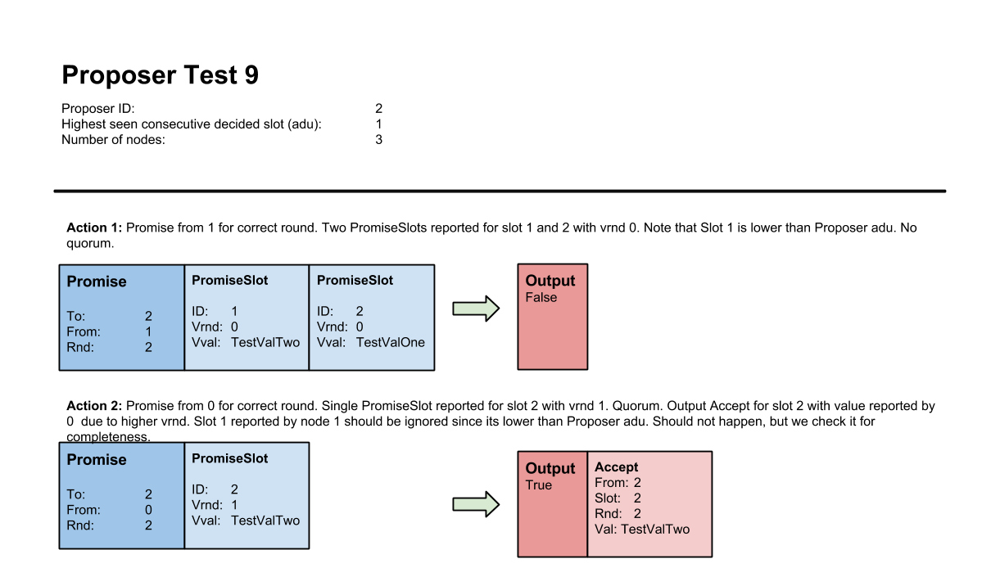

# Lab 4: Single-decree Paxos and Multi-Paxos

| Lab 4: | Single-decree Paxos and Multi-Paxos |
| ---------------------    | --------------------- |
| Subject:                 | DAT520 Distributed Systems |
| Deadline:                | **March 15, 2021 23:59** |
| Expected effort:         | 40-60 hours |
| Grading:                 | Pass/fail |
| Submission:              | Group |

## Table of Contents

- [Lab 4: Single-decree Paxos and Multi-Paxos](#lab-4-single-decree-paxos-and-multi-paxos)
  - [Table of Contents](#table-of-contents)
  - [Background and Resources](#background-and-resources)
  - [Algorithm implementation](#algorithm-implementation)
    - [Specification](#specification)
  - [Distributed implementation](#distributed-implementation)
    - [Multi-Paxos Package](#multi-paxos-package)
      - [Distributed Multi-Paxos Application](#distributed-multi-paxos-application)
      - [Paxos Server](#paxos-server)
        - [Handling Client Connections](#handling-client-connections)
      - [Client Application](#client-application)
      - [Handling TCP Connections](#handling-tcp-connections)
    - [Test Scenarios](#test-scenarios)
  - [Lab Approval](#lab-approval)
  - [Appendix - Proposer Test Cases](#appendix---proposer-test-cases)

## Background and Resources

Practical systems normally use Paxos as a building block to achieve consensus
on a sequence of values.
One way to achieve this would be to run a full instance of single-decree Paxos, both _Phase 1 and 2_, for every value.
This would require four message delays for every value to be decided.
With Multi-Paxos it is possible to reduce this overhead.

Multi-Paxos only perform _Phase 1_ once, when the leader change.
A Proposer, thinking it is the new leader, issues a prepare for every slot higher than the highest consecutive decided slot it has seen.
Every other Paxos acceptors respond to it with a promise if the round is higher than their current one.
The promise message may contain a set of `(vrnd, vval)` tuples for every slot higher or equal to the one from the prepare message, if the acceptor has accepted any value for these slots.

On receiving a quorum of promises, the Proposer is bounded by the highest
`(vrnd, vval)` tuple reported for any slot higher than the slot from the corresponding
prepare message.
The Proposer can then perform _Phase 2_ (accept and learn) for every value to be decided.
Only two message delays are required to get a value accepted.

You are _strongly_ advised to read Section 3, _Implementing a State Machine_,
from _Paxos Made Simple_ by Leslie Lamport for a more complete description of the Multi-Paxos optimization.
You may also find the other [resources](../resources/) listed here useful.

## Algorithm implementation

You will in this task implement the Multi-Paxos algorithm for each of the three
Paxos roles.
The task is similar to what you did for single-decree Paxos, but is more complex since
Multi-Paxos is able to choose multiple commands.
Both _Phase 1_ and _Phase 2_ of the Paxos protocol (as described in _Paxos Made Simple_) needs to be adjusted.
Especially the prepare-promise exchange need changes.

The skeleton code, unit tests and definitions for this assignment can be found
in this package (i.e. multipaxos).
Each of the three Paxos roles has a separate file for skeleton code (e.g. `acceptor.go`) and one for unit tests (e.g. `acceptor_test.go`).
There is additionally a single file called `defs.go`.
This file contain `struct` definitions for the four Paxos messages and other related
definitions.
You should not edit this file.

Similar to the single-decree Paxos each of the three Paxos roles has a similar skeleton code structure.
They all have a constructor, e.g. `NewAcceptor(...) *Acceptor`.
Each Paxos role also have a `handle` method for each message type they should receive. For example, the Acceptor has a method for processing accept messages with the following
signature:

```go
func (a *Acceptor) handleAccept(acc Accept) (lrn Learn, output bool)
```

A `handle` method returns a Paxos message and a boolean value `output`. The
value `output` indicate if handling the message resulted in an output message
from the Paxos module. Example: If an acceptor handles an accept message and
should according to the algorithm reply with a learn message, then the
`handleAccept` would return with `output` set to true and the corresponding
learn message as `lrn`. If handling the accept resulted in no outgoing learn
message, then `output` should be set to false. In other words, the caller
should _always_ check the value of `output` before eventually using the Paxos
message. If `output` is false, then each field of the Paxos message struct
should have the zero value (e.g. initialized using an empty struct literal,
`Acceptor{}`).

The `handleLearn` method from `learner.go` has the following signature:

```go
func (l *Learner) handleLearn(lrn Learn) (val Value, sid SlotID, output bool)
```

The method does not output a Paxos message. The return value `val` instead
represents a value for a specific slot (`sid`) that the Paxos nodes has reached
consensus on (i.e. decided). A difference from the single-decree Paxos learner of the previous task is the return value `sid SlotID`.
This return value indicates what slot the corresponding decided value (`val`) belongs to. The `Value` type definition (in `defs.go`) has also changed from being a type alias for `string` in the previous task to the following struct definition for this task:

```go
type Value struct {
	ClientID  string
	ClientSeq int
 	Noop      bool
	Command   string
}
```

The `Value` type now also carries information about the client that sent the
command. `ClientID` is a unique client identifier. `ClientSeq` represents a
client sequence number. The number should be used by clients to match a
response received from a Paxos system to a corresponding request. The actual
value is now represented by a `Command` field of type `string`. This will represent a command submitted by a client application in the [next part](#distributed-implementation) of this assignment.

The `Round` type definition found in `defs.go` still unchanged:

```go
type Round int

const NoRound Round = -1
```

The Paxos messages has changed slightly to the following:

```go
type Prepare struct {
	From int
	Slot SlotID
	Crnd Round
}

type Promise struct {
	To, From int
	Rnd      Round
	Slots    []PromiseSlot
}

type Accept struct {
	From int
	Slot SlotID
	Rnd  Round
	Val  Value
}

type Learn struct {
	From int
	Slot SlotID
	Rnd  Round
	Val  Value
}
```

The `Prepare`, `Accept` and `Learn` messages have all gotten a `Slot` field of
type `SlotID`. This means that every `Accept` and `Learn` message now relates
to a specific slot. The `Slot` field in the `Prepare` message has a somewhat
different meaning. In Multi-Paxos, as explained [previously](#background-and-resources), a proposer only executes Phase 1 once on every leader change if it considers itself the leader.
The `Slot` field in the `Prepare` message represents the slot after the highest consecutive decided slot the Proposer has seen. This slot identifier is used by an acceptor to construct a corresponding `Promise` as a reply. An acceptor attach information
(`vrnd` and `vval`) for every slot it has sent an accept for equal or higher to
the one received in the prepare message. This information is stored in the
slice `Slots` of type `PromiseSlot`. The slice should be sorted by increasing
`SlotID`. The `PromiseSlot` struct is defined in `defs.go`:

```go
type PromiseSlot struct {
	ID   SlotID
	Vrnd Round
	Vval Value
}
```

To create and append the correct slots (if any) to the slice, an acceptor need
to keep track of the highest seen slot it has sent an accept for. This can for
example be done by maintaining a `maxSlot` variable of type `SlotID`. The
Proposer is bounded by the highest `PromiseSlot` (highest `vrnd`) reported in a
quorum for any slot higher than the slot from a corresponding prepare message.

The `handlePromise` method from `proposer.go` has the following signature:

```go
func (p *Proposer) handlePromise(prm Promise) (accs []Accept, output bool)
```

### Specification

* *Input:* A single `Promise` message.

* The Proposer should ignore a promise message if the promise has a round
  different from the Proposer's current round, i.e. it is not an answer to a
  previously sent prepare from the Proposer.

* The Proposer should ignore a promise message if it has previously received a
  promise from the _same_ node for the _same_ round.

* *Output:* If handling the input promise result in a quorum for the current
  round, then `accs` should contain a slice of accept message for the slots the
  Proposer is bound in. If the Proposer is not bounded in any slot the `accs`
  should be an empty slice. If `output` is false then `accs` should be `nil`.

* All accept messages in the `accs` slice should be in increasing consecutive
  slot order.

* If there is a gap in the set of slots the Proposer is bounded by, e.g. it is
  bounded in Slot 2 and 4 but not 3, then the Proposer should create an accept
  message with a no-op value for the accept for Slot 3 in the `accs` slice.

* If a `PromiseSlot` in a promise message is for a slot lower than the
  Proposer's current `adu` (all-decided-up-to), then the `PromiseSlot` should
  be ignored.

You can find a complete description of proposer test case number 7-11
[here](#appendix---proposer-test-cases).

A few other important aspects of the Paxos roles are listed below:

* A `Promise` message does, for the sake of simplicity, not indicate if a slot
  (`PromiseSlot`) above the slot identifier from the `Prepare` is decided or
  not (the new leader may not have previously learnt it). In this case a slot
  will be proposed and decided again. The Paxos protocol ensure that the same
  value will be decided for the same slot.

* An acceptor only need to maintain a single `rnd` variable (as for
  single-decree Paxos). The `rnd` variable spans across all slots. Only `vrnd`
  and `vval` must be stored for each specific slot. Similarly, the Proposer
  only need to maintain a single `crnd` variable.

* The Paxos roles share no slot history/storage in this implementation. Each
  role should maintain their own necessary variables and data structures for
  keeping track of promises, accepts and learns for each slot.

Summarized, you should for this task implement the following (all marked with
`TODO(student)`):

* Any **unexported** field you may need in the `Proposer`, `Acceptor` and
  `Learner` struct.

* The constructor for each of the two Paxos roles: `NewAcceptor` and
  `NewLearner`. Note that you do not need to use or assign the channels for
  outgoing messages before the [next subtask](#distributed-implementation).
  The `NewProposer` constructor is already implemented. Note that the Proposer
  also take its `adu` as an argument due to testing purposes.

* The `handlePrepare` and `handleAccept` method in `acceptor.go`.

* The `handleLearn` method in `learner.go`.

* The `handlePromise` method in `proposer.go`.

Each of the three Paxos roles has a `_test.go` file with unit tests. You should
not edit these files. If you wish to write your own test cases, which is
something that we encourage you to do, then do so by creating separate test
files. How to run the complete test suite or an individual test cases has been
thoroughly described in previous lab assignments.

The test cases for each Paxos role is a set of actions, more specifically a
sequence of message inputs to the `handle` methods. The test cases also provide
a description of the actual invariant being tested. You should take a look at
the test code to get an understanding of what is going on. An example of a
failing acceptor test case is shown below:

```go
=== RUN TestHandlePrepareAndAccept
--- FAIL: TestHandlePrepareAndAccept (0.00s)
        acceptor_test.go:17:
                HandlePrepare
                test nr:1
                action nr: 2
                action description: prepare slot 1, crnd 1 -> no output, ignore due to lower crnd
                want no output
                got Promise{To: -1, From: -1, Rnd: 0, No values reported}

```

*Note:* You should not (and don't need to) use any of the incoming or outgoing
channels for this task. If you use the outgoing channels the unit tests will
hang since a send on a nil channel blocks forever. This task is solely the core
message handling for each Paxos role. You may need to add fields to each Paxos
role struct to maintain Paxos state. You will use the incoming and outgoing
channels in the next task when you complete the total implementation of each
Paxos role.

## Distributed implementation

For this task you will integrate your Multi-Paxos implementation together with your network and failure/leader detector packages from [Lab 3](../../lab3).
You will additionally extend the application that you developed in lab 3 to handle clients using the Multi-Paxos protocol.

### Multi-Paxos Package

You will need to implement the remaining method stubs to complete each Paxos
role. All Paxos roles has a main message handling loop. The loop
is started in an separate goroutine using each role's `Start()` method. Each
loop uses a `select` statement to handle any incoming message or value. You
should use the handle methods already implemented to process each type of
message and send any resulting reply message using the outgoing channels. An
example taken from the acceptor is shown below:

```go
func (a *Acceptor) Start() {
	go func() {
		for {
			select {
			case prp := <-a.prepareIn:
				prm, output := a.handlePrepare(prp)
				if output {
					a.promiseOut <- prm
				}
				// ...
			}
		 }
	}()
```

The Learner returns both a value and a corresponding slot id from its
`handleLearn` method. It needs to construct a `DecidedValue` (see `defs.go`)
using the value and slot id before sending it on its `decidedOut` channel.

The Proposer is a bit more complex for Multi-Paxos compared to
single-decree Paxos. An initial implementation for the Proposer can
be found in `proposer.go`. Only the `handlePromise` from the previous sub task
is not implemented. It is just a proposal (no pun intended) for how the base
structure of the Proposer may look. The proposal also documents, using code,
its expected behavior. _You should, and most probably must, tweak and adjust the code_.

The Proposer need to keep track of the highest decided _consecutive_ slot the
Paxos node has seen (all decided up to). The Proposer has a
`IncrementAllDecidedUpTo` method that should be used to indicate that a slot
has been reported decided by the Learner. An outside caller _must call this method when slots are decided in consecutive order_ (and wait if any gaps).
The Proposer uses this information for two purposes:

* To attach the slot id for the highest decided slot to any prepare message
  it sends.

* To know if a previously sent accept message has been decided so that it can
  send a new one. _A Proposer is defined for this lab to only be allowed to send an accept for the next slot if the previous slot has been decided_.
  How many slots a proposer may send accept messages for concurrently can be
  generalized with an `alpha` parameter (pipelining). For this lab `alpha`
  consequently equals 1. Also see the Proposer's `sendAccept` method.
  In lab 6 you will experiment with this parameter

Proposer specification (see `select` on line 96):

* **Receive promise message, line number 95:** Handle promise message. Store
  resulting accept messages (if any) if handling the promise result in a
  quorum. Mark Phase One as done. Attempt to send accept message.

* **Receive client request, line number 107:** Ignore request if not the
  leader. If leader, then store command in queue. Continue message handling
  loop if Phase One is not done. Attempt to send accept if Phase One is done.

* **Receive increment adu notification, line number 116:** Increment internal
  `adu`. Continue message handling loop if not leader, or, if leader but Phase
  One is not done. Attempt to send accept if leader and Phase One is done.

* **Phase 1 progress check, line number 125:** The Proposer must be able to
  handle the case where after becoming leader, its `crnd` variable is still
  lower than the previous leaders `crnd`. This may be true even after calling
  its own `increaseCrnd` method on leader change. An acceptor will silently
  ignore a prepare (and accept) message for a lower round than it has already
  seen in a prepare or accept. The Proposer which consider itself the leader
  should therefore use a timer (with an appropriate timeout value) to check
  that it actually receives a quorum of promises after broadcasting a prepare.
  If the timer fires after sending a prepare, and a quorum of promises has not
  received, the Proposer should increase its `crnd`, send a new prepare message
  and start the timer again.

* **Receive trust message, line number 129:**  Store new leader and start Phase
  One if the trust message is for the Proposer's id.

* **_Phase 2_ progress check, line number n/a:** This is not implemented in the
  example code. A Proposer should in theory also verify that the accept
  messages it sends are eventually decided (if it still consider itself the
  leader). A proposer might get stuck waiting for a slot to be decided if an
  accept message is lost (for example when using UDP). You may _optionally_
  implement such a progress check if you want.

A proposer should send an accept if it considers itself the leader and the
previous slot has been decided. It should first check if there is any remaining
accept messages in its accept message queue. The queue contain any accept
messages generated as part of Phase One. The Proposer should send the
appropriate accept if the queue is non-empty. The Proposer should check its
client request queue if the accept queue is empty. The Proposer should generate
an Accept message using a client request if available. The Proposer must wait
for a client request before sending an accept if the queue is empty. See also
the code and comments for the `sendAccept` method.

*Summary:* You should in this part implement the following in the
`multipaxos` package (all marked with `TODO(student)`):

* Any more **unexported** fields you may need in the `Proposer`, `Acceptor` and
  `Learner` struct.

* Any additions to the constructor for each of the three Paxos roles:
  `NewProposer`, `NewAcceptor` and `NewLearner`. You should not change the
  signature of the constructor functions.  Note that you will need to use and
  assign the channels for outgoing messages for this task.

* The `Start` and `Stop` method the Acceptor and Learner.

* All `Deliver` methods for the Acceptor and Leaner.

* Any internal changes to the Proposer you may want.

#### Distributed Multi-Paxos Application

Your system should in this assignment use the Multi-Paxos protocol to replicate a set of commands. Clients can issue commands to Paxos servers. Commands
sent by clients should be sequenced in the same order by all nodes using the
Multi-Paxos protocol you have implemented.

Your application should at least consist of the following parts:

 * The Failure and Leader detector from Lab 3.

 * The three Multi-Paxos roles (proposer, acceptor and learner) implemented in this lab assignment.

 * The network layer you started working on in Lab 3. Your network layer must be
  able to handle the new set of Multi-Paxos messages in addition to the Heartbeat
  message from Lab 3.

 * A server module that coordinates the interactions between the Paxos modules and failure/leader detector modules.

 * A client handling module for interacting with clients.

A rudimentary overview of how the different modules should interact is shown
below. Note that the arrows only represent a general form of interaction.


Your network layer from the previous lab should be extended to handle
the overall requirements of this lab. The Failure and Leader detector should
not need any changes.

#### Paxos Server

A server module is needed to coordinate the different parts of your
node. It should at least perform the following tasks:

* Initialize and start all the relevant parts your node (Multi-Paxos modules and failure/leader detectors).
* Multiplex and demultiplex message to and from the network layer.
* Keep track of the id of highest decided slot.
* Notify the Proposer when a new slot has been decided.
* Notify clients about the decided values (if the
  client handling module does not interact directly with the Learner).
* Route client requests from the network to the Proposer (if the
  client handling module does not interact directly with the Proposer).

The server module should forward any command received from a connected client to the proposer using the `DeliverClientValue` method.
The Proposer should in turn propose the command if it consider itself the current leader.
If the proposed is not the leader, the server can forward the received message to another server that he believes to be the current leader.

The Paxos server should reply to a client the decided values.
A `Response` has therefore been defined in `defs.go` from the `multipaxos` package:

```go
type Response struct {
	ClientID  string
	ClientSeq int
	Command   string
}
```

The Paxos server should generate a response after received the decision from some learner.
The `ClientID`, `ClientSeq` and `Command` fields should be populated from
the corresponding decided value.
Client handling details are described in the [next subsection](#handling-client-connections).

Thus, the server should listen for decided values from the learner using the
`decidedOut` channel. Any decided value should be given to the client handling
module, which in turn should forward it to _every_ connected client.
All nodes should decide on the same ordered sequence of commands ensured by the Multi-paxos protocol and it should be possible to display in the client the list of commands decided so far.

A learner may, as specified previously, deliver decided values out of order.
Your server therefore needs to ensure that only decided values (commands) are processed in order.
The application needs to keep track of the `id` for the highest decided slot to accomplish this.
This assignment text will use the name `adu` (i.e. all decided up to) when referring to this variable.
It should initially be set to -1.
The application should buffer _out-of-order_ decided values and only display them to the user when it has consecutive sequence of decided slots. More specifically the application should handle decided values from the learner equivalently to the logic in the following pseudo code:

```go
on receive decided value v from learner:
	handleDecideValue(v)
```

```go
handleDecidedValue(value):
	if slot id for value is larger than adu+1:
		buffer value
		return
	if value is not a no-op:
		process the command from the received value
	increment adu by 1
	increment decided slot for proposer
	if has previously buffered value for (adu+1):
		handleDecidedValue(value from slot adu+1)
```

_Note_: The application should not process commands if the decided value has its `Noop` field set to true. It should for a no-op only increment its adu and call the `IncrementAllDecidedUpTo()` method on the Proposer.

##### Handling Client Connections

The server should listen for and handle client connections.
Clients should connect to _all_ servers and send any command to _all_ of
them.
The commands should be of type `string`, thereby matching the `Command` field of the `Value` type used by the Multi-Paxos roles.

Each Paxos server should have a module for receiving client requests and sending
client responses. Specification:

* The module should accept connections from clients. A client
  should exchange their identifier with the server so that a server can use
  the id to store and lookup the connection. See also the description of the
  client application in the next subsection.

* A client should be redirected if it connect _or_ send a request to a
  non-leader node.

* A client response, as described in the previous subsection, should be of type
  `Response` found in `defs.go` from the `multipaxos` package.

* Upon receiving a decided `Value` from the Multi-Paxos module, the server should create a `Response` and attempt to send it to the client if it is connected.
  It can ignore any errors resulting from trying to send the response to the
  client.

#### Client Application

You should for this lab create a stand-alone client application to interact
with your Multi-Paxos system.

* Every client should generate a unique identifier for itself. A client may for
  example use its IP-address or generate an identifier randomly. This
  identifier should be exchanged when connecting to a server and be used
  for the `ClientID` field in every request (`Value`) sent.

* A client should always send requests synchronously, i.e. wait for a response
  to the previous request before sending a new one.

* A client should maintain a internal sequence number, i.e. a client-local
  unique command identifier. It should be used to distinguish between different
  user commands. The sequence number is included in responses from the Multi-Paxos
  nodes and lets a client match responses to sent commands.

* A client request is defined to be an instance of the `Value` struct from
  `defs.go`. A client should populate the `ClientID` and `ClientReq` fields
  accordingly. A client should not set the `Noop` field. The `Command` field should be set based on user input via command-line.

* The client application should have a command-line interface.
  It should be possible to send a command to the system by asking the user for the necessary input.

* A client should attempt to reconnect to a different node for the following
  cases:
  * Timeout on `Dial`, `Read` and `Write` (e.g. see `SetDeadline`
    methods).
  * Connection close (`io.EOF` error for TCP).
  * Any other dial, read, or write error.

#### Handling TCP Connections

*Note:* Some groups have in the previous lab assignments created a new TCP
connection when sending a message over the network. You should reuse
connections if your implementation uses _TCP_ for network communication.
Implementations that establish a new TCP connection for every message will get
a reduced score. The same also applies to client connections.

### Test Scenarios

You should for this lab, in addition to explaining your code and design, present a working demo of your application. You will at least be asked to demonstrate the following scenario:

1. Start a cluster consisting of three server nodes. Each one performing the Multi-Paxos roles and running the failure/leader detector modules.

2. Start two clients.

3. Send a command (string) to the system from a single client. The value of this command should be decided and all connected clients should receive the value as a response.

3. Send a few commands from two different clients. All commands should be eventually decided and all clients should receive the same sequence of decided commands.

4. Stop the leader Paxos node (i.e. one of the servers) and let the system choose a new leader. Let the clients connect to the new leader and send yet another command. The system should still working. In this point you will have only two servers and two clients running.

5. Demonstrate that a client connects to a different node if it does not receive
   a response to a request after some duration or if the connection to the
   current leader has gone down.

6. Stop one of the two remaining servers.
   Send another client command.
   The client should not receive any reply to this command.
   No decision should be made. In this point you will have only one server and two clients running. Do you know why a decision cannot be made? What happens if you start another server and send the command again?

## Lab Approval

To have your lab assignment approved, you must come to the lab during lab hours
and present your solution. It is also possible to present your work online using the Discord.
The goal is that you present the thoughts and process behind your solution, providing to us more information for approval purposes and we may also provide feedbacks on your solution.
When you are ready to show your solution, reach out to a member of the teaching staff.
You can also use the Discord bot to request a lab approval, by typing `!approve`.
A staff will be notified and enter in contact with you to mark an appointment.
Please, note that due to the limit number of teaching assistants you need to plan in advance when you want to get your lab approved. If you let for the last day or hours before the final deadline, a staff may not be available.
It is expected that you can explain your code and show how it works. You may show your solution on a lab workstation or your own computer.

**The results from Autograder will be taken into consideration when approving this lab.**

You should for this lab present a working demo of the application described in
the previous section. The application should run on at least three machines in
the lab (not enough to run just on localhost, except if your nodes are docker containers and you create a private network for them). You should demonstrate that your implementation fulfills the previously listed specification. The task will be verified by a member of the teaching staff during lab hours.

Also see the [Grading and Collaboration Policy](https://github.com/dat520-2021/course-info/blob/master/policy.md) document for additional information.

## Appendix - Proposer Test Cases





